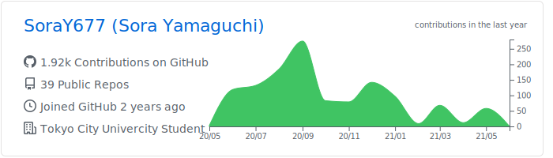
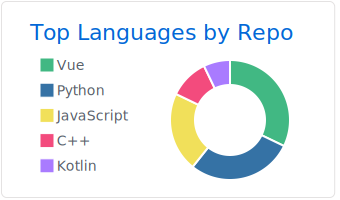
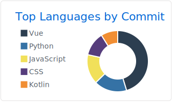
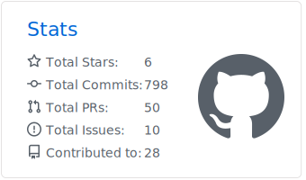
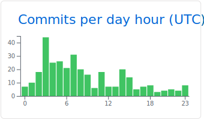

<div align="center">
 
# [Sora YAMAGUCHI](https://soray677.vercel.app/)
 

 
###  Web / ML Developer


# [✉ Contact Form](https://forms.gle/huP4UNecBm36ir7dA) 

<br />
<br />

</div>

# Portfolio
[](https://soray677.vercel.app/)


<div align="center">

<br>

[](https://github.com/vn7n24fzkq/github-profile-summary-cards)
[](https://github.com/vn7n24fzkq/github-profile-summary-cards) [](https://github.com/vn7n24fzkq/github-profile-summary-cards)
[](https://github.com/vn7n24fzkq/github-profile-summary-cards) [](https://github.com/vn7n24fzkq/github-profile-summary-cards)

</div>

# Products

## 字幕くん


`released:2024.7` / [サービスを見てみる👀](https://jimaku.noted.run/?mode=demo)

```
「ちょっと動画に字幕を付けたいだけなのに…」そんな方におすすめ。動画に字幕を付けるためのアプリをご紹介です。
タイムライン表示やリアルタイムプレビューを使って、直感的にテキストやタイミングの調整が可能です。
ネット上に動画をアップロードせずローカルで完結するため、プライバシーを重視しながら、スムーズな字幕編集をサポートします。
```

## 表情を読んでブラフを仕掛けてくるポーカーAI (大学卒業研究)


`published:2021.3` / 
[概要を読む📖](https://www.comm.tcu.ac.jp/otani-lab/research/bachelor/1772091.pdf)
 ・システム準備中🚧

```
コンピュータがユーザを理解し、ユーザとの関わりを確立する一助としてポーカーを題材にした卒業研究を行いました。
この研究で開発したシステムはブラウザ上で動作します。ユーザの表情をリアルタイムに読み取り、
それをAIに情報の一つとして与えることで、AIはユーザの癖を見抜きその人専用の良い対戦相手として成長していくのです。
ぜひ皆さんにも遊んでいただいて楽しんでもらえればと考えております。
```


## ピクトスタジオ


`released:2022.6` / [サービスを見てみる👀](https://pict-studio.raxsy.life/)

```
個人開発で作成し、現在公開中のサービスです。
Web上で自由にピクトグラムを動かして好きなアイコンを作成できます！
資料などに追加するイラストがなくて困っている方や膨大な情報からピッタリのアイコンが見つからないそこのあなた！
探すのではなく'創ってしまう'なんていかがでしょう？
```

# Blogs
[](https://qiita.com/SoraY677)
[](https://zenn.dev/soray677)
[](https://noted.run/author/soray/)


# Organize

|OtaniLab|Noted|
|:---:|:---:|
|[](https://www.comm.tcu.ac.jp/otani-lab/)|[](https://noted.run/)|
|2020-<br>(University)|2021-|

# Certifications

|||
|:---:|:----|
||<h3>[FE(基本情報技術者)](https://www.ipa.go.jp/shiken/kubun/fe.html)</h3><br/> `2017.6.21-` |
||<h3>[AP(応用情報技術者)](https://www.ipa.go.jp/shiken/kubun/ap.html)</h3><br/> `2019.11.15-`|
||<h3>[Deep Learning for GENERAL](https://www.jdla.org/certificate/general/)</h3><br/> `2020.11.24-`|
||<h3>[AWS Certified Solutions Architect – Associate](https://aws.amazon.com/jp/certification/certified-solutions-architect-associate/)</h3><br/> `2022.04.16 - 2025.04.16`|

# Others

### ハッカソン

- [都知事杯オープンデータ・ハッカソン 2024](https://www.youtube.com/watch?v=B--Pl4bJK_A&t=13195s)
- [サマーハッカソン](https://docs.google.com/presentation/d/1ERukzdo4WZiKEWT26RRP2hUVEvxI--zdpxyC6ac23U4/edit?usp=sharing)
- [Yahoo Hack Day2021](https://github.com/SoraY677/HackDay2021-Frontend)
- [HackU 2020](https://docs.google.com/presentation/d/1WlkjDiBDHRh1hvFM5gPDbpzC_ulCuU7jC-wHMagtETM/edit?usp=sharing)
- [Greeg Hackthon2020](https://docs.google.com/presentation/d/1zTezE3UvcV4I94-VsXZlN2-DX9QcNr1bHipSSeRL5J4/edit?usp=sharing)
- [Yahoo Hack Day2019](https://www.youtube.com/live/HNjXZwRTybU?t=6151s)
- [LocalHackDay 2019](https://github.com/SoraY677/LocalHackDay2019)


### [AtCoder](https://atcoder.jp/?lang=ja)
Rate: Gray/249  

### [進化計算コンペティション（進化計算学会）](https://ec-comp.jpnsec.org/ja)
現実に即した様々な問題を進化計算という最適化手法で解決しようするコンペティションです。以下に参加しました。 

- 2020年: ゲームを楽しくする乱数の設計: [GAと焼きなまし法を用いたゲームを楽しくする乱数の生成手法提案](https://docs.google.com/presentation/d/1n985njJ_NF0Ham8HQJ1IPl9y7m5ubBCK/edit#slide=id.p1)
- 2021年: 社会シミュレーションによる経済支援施策の設計: [蜂コロニーアルゴリズムを応用した局所解に陥らない汎用ソルバの開発](https://docs.google.com/presentation/d/1icmMnyKHwFYU8dBc2kRP9QpN1nXZQoRDEszbPMsWICg/edit?usp=sharing)
- 2022年: 群集シミュレーションを用いた発生交通量推定: [GAを応用した群衆行動の傾向予測](https://docs.google.com/presentation/d/1j1Y6-gmTdBRDLzLA213cWAYbSJSmuZdpBaBstioGRC8/edit?usp=sharing)
- 2023年: 機械加工スケジューリング問題: [遺伝的k-meansアルゴリズムを用いた機械加工スケジューリングの最適化手法](https://zenn.dev/soray677/articles/a2ba94b010ad3e)

### [ISUCON](https://isucon.net)
お題となるWebサービスを決められたレギュレーションと制限時間の中で高速化を図るチューニングコンテストです。
以下に参加しました。

- 2022年: [ISUCON12予選参加](https://isucon.net/archives/56571716.html): 4144点
- 2023年: [ISUCON13本戦参加](https://isucon.net/archives/57801192.html): 16292点 (再起動の試験失格で0点)
