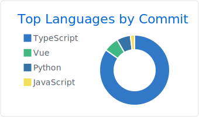

## 🎉 Introduction

どうも。山口宙来（やまぐちそら）と申します。   
普段はウェブ周りの開発をメインにやってますが、IT全般の問題を解決していきたいです。  

Hi. My name is YAMAGUCHI Sora.  
I work as Web-Engineer mainly. but, solve any IT problems as flexible.  

## 🧰 Tech

 
 

## ☄ Output
### blog

## 🤝 Organization

|||
|:---:|:---:|
|Otani-lab||
|Noted | |
|Raxsy||

## 🔖 Licence

- FE(IPA)
  - 2017.11
- AP(IPA)
  - 2019.6
- Deep Learning for GENERAL
  - 2020.11
- AWS Certified Solutions Architect – Associate
  - 2022.4

## 📮 Contact 
[Google Form](https://forms.gle/U6TitZDLi14q6n2FA)

