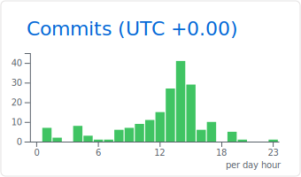

## Sora Yamaguchi
###  Web Developer

 
 

- [FE(IPA)](https://www.jitec.ipa.go.jp/1_11seido/fe.html)
- [AP(IPA)](https://www.jitec.ipa.go.jp/1_11seido/ap.html)
- [Deep Learning for GENERAL](https://www.jdla.org/certificate/general/)
- [AWS Certified Solutions Architect – Associate](https://aws.amazon.com/jp/certification/certified-solutions-architect-associate/)

- Atcoder

### blog

📮[Google Form](https://forms.gle/U6TitZDLi14q6n2FA)

