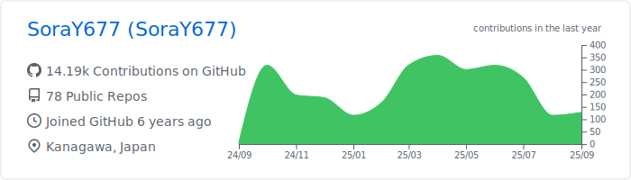

# Sora Yamaguchi
###  Web Developer + α

  

### Contact to me! 👇
### https://forms.gle/U6TitZDLi14q6n2FA

  

 
 

# Products

[TODO]

# Blog

# Organize

|OtaniLab|Noted|
|:---:|:---:|
|||
|20years- (University)|21years-|

# Certifications

|||
|:---:|:----|
||<h3>[FE(基本情報技術者)](https://www.jitec.ipa.go.jp/1_11seido/fe.html)</h3> 2017.6.21- |
||<h3>[AP(応用情報技術者)](https://www.jitec.ipa.go.jp/1_11seido/ap.html)</h3> 2019.11.15-|
||<h3>[Deep Learning for GENERAL](https://www.jdla.org/certificate/general/)</h3> 2020.11.24-|
||<h3>[AWS Certified Solutions Architect – Associate](https://aws.amazon.com/jp/certification/certified-solutions-architect-associate/)</h3>  2022.04.16 - 2025.04.16|

# Others

【Atcoder】Rate.Gray/249  

