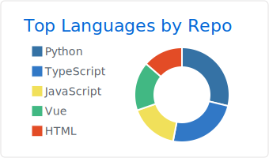

# Sora Yamaguchi - 山口宙来
###  Web Developer

---

 
 

- [FE(IPA)](https://www.jitec.ipa.go.jp/1_11seido/fe.html)
  - 2017.11
- [AP(IPA)](https://www.jitec.ipa.go.jp/1_11seido/ap.html)
  - 2019.6
- [Deep Learning for GENERAL](https://www.jdla.org/certificate/general/)
  - 2020.11
- [AWS Certified Solutions Architect – Associate](https://aws.amazon.com/jp/certification/certified-solutions-architect-associate/)
  - 2022.4

### Atcoder

## ☄ Output

### Product

### blog

## 🔖 Licence

- [FE(IPA)](https://www.jitec.ipa.go.jp/1_11seido/fe.html)
  - 2017.11
- [AP(IPA)](https://www.jitec.ipa.go.jp/1_11seido/ap.html)
  - 2019.6
- [Deep Learning for GENERAL](https://www.jdla.org/certificate/general/)
  - 2020.11
- [AWS Certified Solutions Architect – Associate](https://aws.amazon.com/jp/certification/certified-solutions-architect-associate/)
  - 2022.4

## 📮 Contact 
[Google Form](https://forms.gle/U6TitZDLi14q6n2FA)

